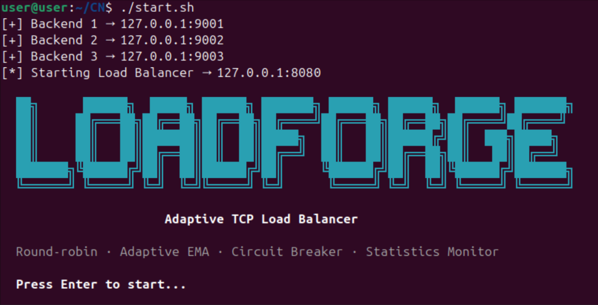
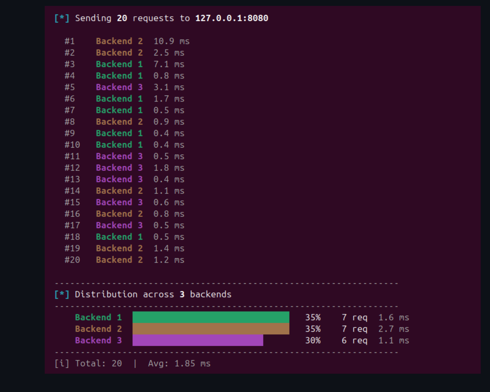
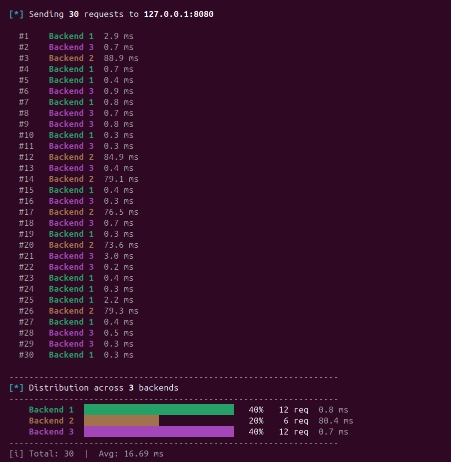
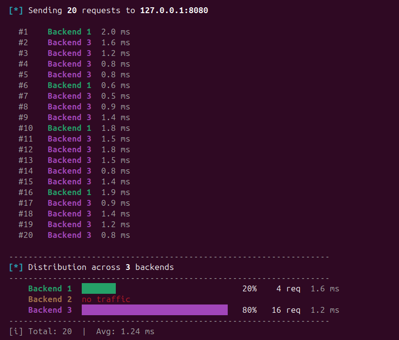
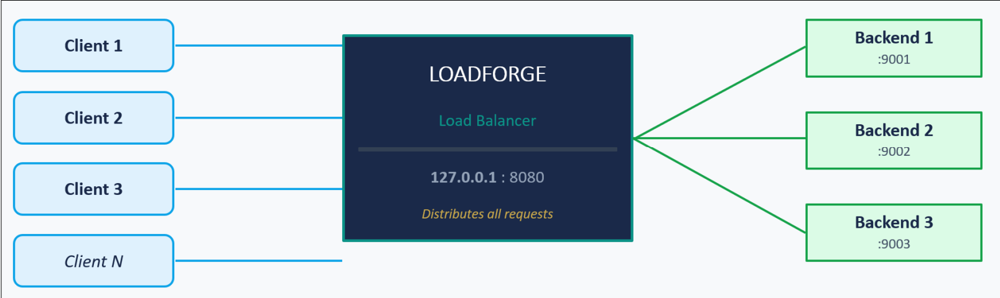
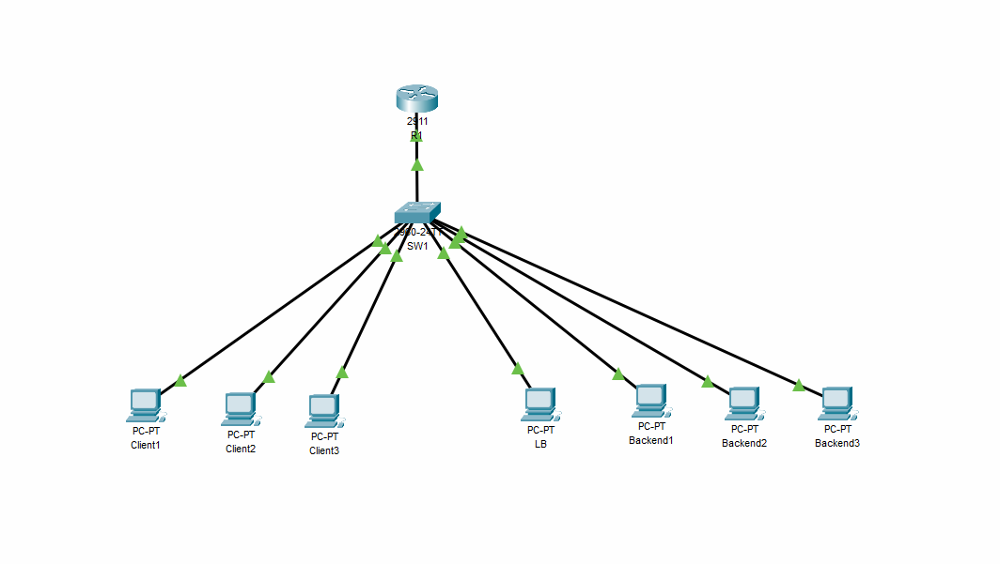
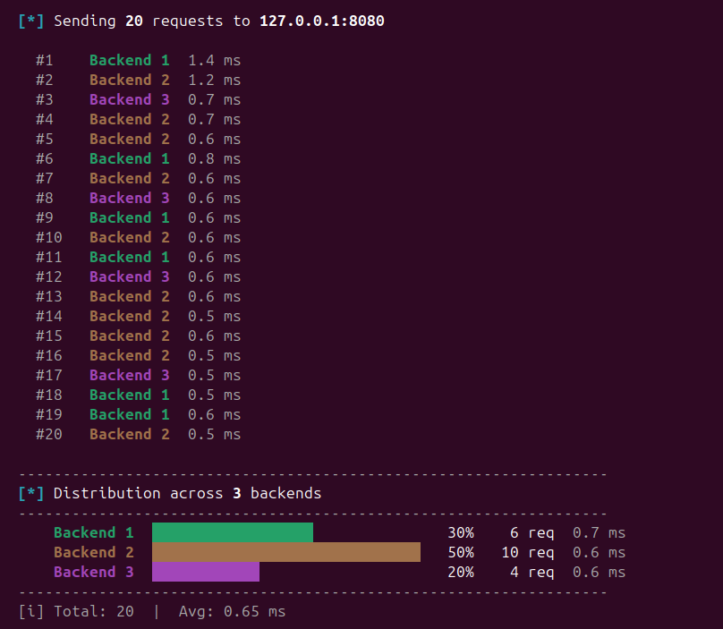

<div align="center">



<h1>LoadForge</h1>

<p><strong>A multi-subnet TCP load balancer with adaptive routing and automatic fault detection — written from scratch in C.</strong></p>

<p>
No NGINX. No HAProxy. No framework. Every byte of the routing algorithm, circuit breaker, and health system is hand-written on the raw POSIX socket API — and deployed on a real two-VLAN Cisco network, not just localhost.
</p>

<p>
<a href="#-quick-start">Quick Start</a> ·
<a href="#-how-it-works">How It Works</a> ·
<a href="#-demo">Demo</a> ·
<a href="#-architecture">Architecture</a> ·
<a href="docs/LoadForge-Project-Report.docx">Full Report</a>
</p>

<p>


</p>

</div>

---

## Table of Contents

- [Why LoadForge](#why-loadforge)
- [Features](#features)
- [🚀 Quick Start](#-quick-start)
- [🧠 How It Works](#-how-it-works)
- [🎬 Demo](#-demo)
- [🏗️ Architecture](#-architecture)
- [🌐 Network Design](#-network-design)
- [🧵 Threading Model](#-threading-model)
- [⚙️ Configuration](#-configuration)
- [🕹️ Live Control](#-live-control)
- [🧪 Testing](#-testing)
- [📁 Project Layout](#-project-layout)
- [🗺️ Roadmap](#-roadmap)
- [📚 Documentation & References](#-documentation--references)

---

## Why LoadForge

A single server buckles under a traffic spike, dies without failover, and — if clients can reach your application or database servers directly — leaks a security hole. A load balancer fixes all three. But most academic projects just *configure* NGINX; the algorithm stays a black box.

**LoadForge builds it from zero.** Every routing decision, every failure-detection path, every line, is authored and explainable — and it runs on a real Cisco two-VLAN topology with an ACL that makes the backends physically unreachable from the client subnet.

| Scenario | Without a load balancer | With LoadForge |
| --- | --- | --- |
| **Traffic spike** | One server takes every connection → crash | Spread across the pool; none overwhelmed |
| **Backend dies** | Every client errors; total outage | Detected and removed from rotation, zero client impact |
| **Backend degrades** | Slow server keeps getting equal traffic | EMA notices; its share drops automatically |
| **Backend recovers** | Operator must re-add it by hand | Circuit breaker re-admits it within 30 s |
| **Direct backend access** | Backends exposed — a security risk | Blocked at the router by ACL; only the LB is reachable |

## Features

- ⚡ **Adaptive routing** — softmax-weighted selection over a dual EMA (network + processing latency), with an 8% floor so recovered backends are re-discovered fast
- 🎯 **Warm-up phase** — strict round-robin until real latency samples exist, so early routing is never a guess
- 🔌 **Circuit breaker** — per-backend `CLOSED → OPEN → HALF-OPEN` state machine with automatic 30-second recovery probing
- 🐕 **Watchdog** — monitors backend PIDs and restarts crashed processes (`fork` + `execl`) within ~3 seconds
- ❤️ **Active health checks** — every backend pinged every 2 seconds, independent of client traffic
- ♻️ **Hot reload** — add or drain backends live via `config.json` or the `lf-ctl` tool — no restart
- 🧵 **Fully threaded** — 8-worker pool over a bounded queue + 6 background service threads, single-mutex guarded
- 🛡️ **Overload protection** — bounded 100-slot queue returns `503` under saturation instead of collapsing
- 📊 **Live dashboard** — in-place ANSI terminal panel: health, circuit state, dual-EMA latency, connection counts
- 🌐 **Real network** — two VLANs, router-on-a-stick, DHCP, and an ACL that hides the backends

## 🚀 Quick Start

**Prerequisites** — Ubuntu 20.04+ with a C toolchain and libjson-c:

```bash
sudo apt-get update && sudo apt-get install -y build-essential libjson-c-dev
```

**Build & run** — all four binaries compile with `-Wall -Wextra` and zero warnings:

```bash
git clone https://github.com/YOUR_USERNAME/LoadForge.git
cd LoadForge
make
./start.sh        # launches 3 backends + the load balancer, then press Enter
```

**Send traffic** from a second terminal:

```bash
./bin/client                              # interactive dashboard
./bin/client 127.0.0.1 8080 --burst 30    # 30 requests + a distribution report
```

**Watch it self-heal** — kill a backend and the watchdog restarts it within ~3 s:

```bash
kill $(pgrep -f "backend.*9002")
```

Stop everything with `./stop.sh`.

## 🧠 How It Works

LoadForge combines four classic techniques. Each is small, each is explainable, and together they behave like a production load balancer.

### 1 · Warm-up → adaptive transition
On startup there's no latency data, so adaptive routing would be arbitrary. LoadForge runs **strict round-robin for the first `N × 10` connections** (30 for 3 backends), giving every backend a real baseline before adaptive routing is allowed to shift the distribution.

### 2 · Adaptive softmax selection
After warm-up, each backend's latency becomes a selection probability:

```
score       = 0.3 × ema_network_ms + 0.7 × ema_processing_ms + active_conns × 2.0
raw_weight  = exp(-score / 50)                              // SOFTMAX_TEMP = 50 ms
weight[i]   = 0.08 + 0.92 × (raw_weight[i] / Σ raw_weight)  // 8% minimum floor
```

A backend at 200 ms gets ~1/50th the probability of one at 10 ms — but the **8% floor** keeps a trickle flowing to every backend, so recovery is noticed quickly. The `active_conns × 2.0` term penalizes backends that are already busy.

### 3 · Dual EMA — network vs processing time
Two separate exponential moving averages per backend, because a slow *link* and a slow *CPU* are different problems:

```
decay              = exp(-elapsed_ms / 5000)
ema_network_ms     = decay × old + (1 - decay) × connect_time      // TCP connect() only
ema_processing_ms  = decay × old + (1 - decay) × PROCESS_TIME_MS   // backend compute time
```

Processing is weighted 70% and network 30%, reflecting that compute time affects users more — and separating them stops network jitter (near-zero on localhost, real across subnets) from causing needless backend switches.

### 4 · Circuit breaker
A three-state machine per backend, fully automatic:

| Transition | Trigger | Result |
| --- | --- | --- |
| `CLOSED → OPEN` | 3 consecutive `connect()` failures | Backend out of rotation for 30 s |
| `OPEN → HALF-OPEN` | 30-second timeout elapses | One probe connection allowed |
| `HALF-OPEN → CLOSED` | Probe succeeds | Backend fully restored |
| `HALF-OPEN → OPEN` | Probe fails | Circuit re-opens, timer resets |

> **Non-blocking connect:** every backend connection uses the `O_NONBLOCK` + `select()` pattern with a hard 2-second timeout, verified via `getsockopt(SO_ERROR)` — so one stuck backend can never stall a worker.

## 🎬 Demo

**Even distribution under round-robin** — during warm-up, requests spread evenly (35 / 35 / 30%) while baseline latencies are gathered.

<div align="center">

</div>

**Adaptive routing kicks in** — Backend 2 is slowed to ~80 ms; LoadForge detects the rising EMA and steers traffic to the fast backends while still probing the slow one.

<div align="center">

</div>

**Automatic recovery** — a downed backend trips the breaker `OPEN`, then a `HALF-OPEN` probe succeeds and it returns to `CLOSED`, with no operator action.

<div align="center">

</div>

## 🏗️ Architecture

The load balancer is the sole entry point: clients connect only to it, and it distributes every request across the backend pool.

<div align="center">

</div>

Internally, each request flows through a bounded queue and an 8-worker pool; `select_backend()` picks a target (round-robin during warm-up, EMA-adaptive once latencies diverge), passes it through the circuit breaker, opens the connection, and relays the response — updating the backend's dual EMA on the way back. Six background threads run continuously alongside this path.

| Layer | Component | Technology | Address |
| --- | --- | --- | --- |
| Client | Client PCs (×3) | VLAN 10 — `192.168.1.0/24` | DHCP assigned |
| Network | Cisco Router 2911 | Router-on-a-stick, 802.1Q | `192.168.1.1`, `192.168.2.1` |
| Network | Cisco Switch 2960 | VLAN 10 / VLAN 20 trunk | — |
| Load Balancer | `lb.c` | C / POSIX sockets / pthreads | `192.168.2.10:8080` |
| Backend | `backend.c` × 3 | C / POSIX sockets / pthreads | `192.168.2.11–13 : 9001–9003` |

## 🌐 Network Design

Built and validated in Cisco Packet Tracer — a two-VLAN topology with a router-on-a-stick and an ACL security boundary.

<div align="center">

</div>

- **VLAN 10 — Clients** (`192.168.1.0/24`): PCs get addresses via DHCP on the router.
- **VLAN 20 — Servers** (`192.168.2.0/24`): the LB (`.10`) and backends (`.11–.13`) use static IPs.
- **Router-on-a-stick:** one physical port split into two 802.1Q sub-interfaces routes between the VLANs without a Layer-3 switch.
- **ACL:** an extended ACL lets `192.168.1.0/24` reach **only** `192.168.2.10`. Direct client access to backends is dropped at the router — the backends are unreachable except through LoadForge.

## 🧵 Threading Model

One global mutex guards all shared state (round-robin counter, EMA values, breaker flags, connection counts). **No lock is ever held during blocking socket I/O**, and idle workers block on a condition variable — zero CPU while the queue is empty.

| Thread | Count | Responsibility |
| --- | --- | --- |
| Main | 1 | `accept()` loop; enqueues connections |
| Workers | 8 | Selection, `connect()`, relay, EMA update |
| Health | 1 | Pings every backend every 2 s |
| Watchdog | 1 | Restarts dead backends, sets breaker `HALF-OPEN` |
| Dashboard | 1 | Redraws the live panel every second (ANSI) |
| Control | 1 | Unix-socket server for `lf-ctl` |
| Config reload | 1 | Polls `config.json` every 5 s; merges live |
| Stats logger | 1 | Appends JSON to `/tmp/lf_stats.log` every 10 s |

## ⚙️ Configuration

Everything lives in `config/config.json`, read at startup and watched for live changes:

```json
{
  "listen_ip": "127.0.0.1",
  "listen_port": 8080,
  "algorithm": "adaptive",
  "backend_bin": "./bin/backend",
  "backends": [
    { "id": 1, "ip": "127.0.0.1", "port": 9001, "weight": 1 },
    { "id": 2, "ip": "127.0.0.1", "port": 9002, "weight": 1 },
    { "id": 3, "ip": "127.0.0.1", "port": 9003, "weight": 1 }
  ]
}
```

| Key | Default | Description |
| --- | --- | --- |
| `listen_ip` | `127.0.0.1` | Bind address (`192.168.2.10` for the Cisco topology) |
| `listen_port` | `8080` | TCP port to listen on |
| `algorithm` | `adaptive` | `round_robin` forces strict RR; `adaptive` uses EMA after warm-up |
| `backend_bin` | `./bin/backend` | Executable the watchdog restarts |
| `weight` | `1` | Weighted round-robin multiplier |

### Backend simulation modes
The backend can generate real workloads to exercise the algorithm — each consumes genuine resources and reports an accurate processing time:

| Mode | Argument | Simulates |
| --- | --- | --- |
| Normal | *(none)* | Healthy backend, instant response |
| Delay | `delay 200` | Slow DB / I/O waits (200 ms) |
| CPU | `cpu` | Encryption / compression (prime sieve over 2M numbers ×4) |
| Memory | `memory` | Memory pressure (4 MB buffer) |
| I/O | `io` | Disk access (1 MB temp file) |

```bash
./bin/backend 127.0.0.1 9002 2 delay 200   # a deliberately slow backend
```

## 🕹️ Live Control

`lf-ctl` talks to the running load balancer over a Unix socket — no restart, under active traffic:

```bash
./bin/lf-ctl STATUS                  # current backends, health, circuit state
./bin/lf-ctl ADD 192.168.2.14 9004   # add a backend live
./bin/lf-ctl REMOVE 3                # drain and remove a backend
./bin/lf-ctl SET_ALGO round_robin    # switch algorithm on the fly
```

Editing `config.json` achieves the same hot-reload: new backends are added live, removed ones are *drained* (existing connections finish, no new ones).

<div align="center">

<br><sub>The live dashboard refreshes in place every second.</sub>
</div>

## 🧪 Testing

```bash
make test
```

| Test | Verifies |
| --- | --- |
| T1 | Warm-up active for the first `N × 10` requests |
| T2 | Adaptive routing triggered by a CPU-heavy backend |
| T3 | Watchdog detects and restarts a crashed backend |
| T4 | Circuit breaker `CLOSED → OPEN → HALF-OPEN → CLOSED` |
| T5 | Health check marks an unreachable backend `DOWN` |
| T6 | 150 concurrent clients trigger queue overflow / `503` |

## 📁 Project Layout

```
LoadForge/
├── src/
│   ├── lb.c            # Load balancer core (~1200 LOC): routing, breaker, relay,
│   │                   #   health, watchdog, dashboard, hot-reload, control, stats
│   ├── backend.c       # Multi-threaded TCP backend + load simulations
│   ├── client.c        # Interactive test client (burst mode + distribution chart)
│   ├── config.c        # config.json parser (libjson-c)
│   └── lf_ctl.c        # Control CLI — STATUS / ADD / REMOVE / SET_ALGO
├── include/config.h    # Shared structs, constants, declarations
├── config/config.json  # Listen address, backend list, algorithm, weights
├── scripts/            # add_backend.sh helper
├── tests/              # run_tests.sh
├── assets/screenshots/ # Diagrams and terminal captures
├── docs/               # Full project report (.docx)
├── start.sh · stop.sh · run_demo.sh
└── Makefile
```

## 🗺️ Roadmap

- [ ] Consistent hashing for sticky sessions
- [ ] HTTP-aware, content-based routing
- [ ] Prometheus `/metrics` endpoint
- [ ] TLS termination via OpenSSL

## 📚 Documentation & References

📄 **[Full project report →](docs/LoadForge-Project-Report.docx)** — complete design rationale, block diagrams, algorithm walkthroughs, the Cisco topology, and step-by-step demonstrations.

Built on the shoulders of: Tanenbaum & Wetherall, *Computer Networks* (5th ed.) · Stevens & Rago, *UNIX Network Programming* Vol. 1 (3rd ed.) · Butenhof, *Programming with POSIX Threads* · Nygard, *Release It!* · Box & Jenkins, *Time Series Analysis* · RFC 793 (TCP) · POSIX.1-2008 · Cisco CCNA / Packet Tracer documentation.

---

<div align="center">
<sub>Built from scratch in C — every function, every algorithm, owned end to end.</sub>
</div>
